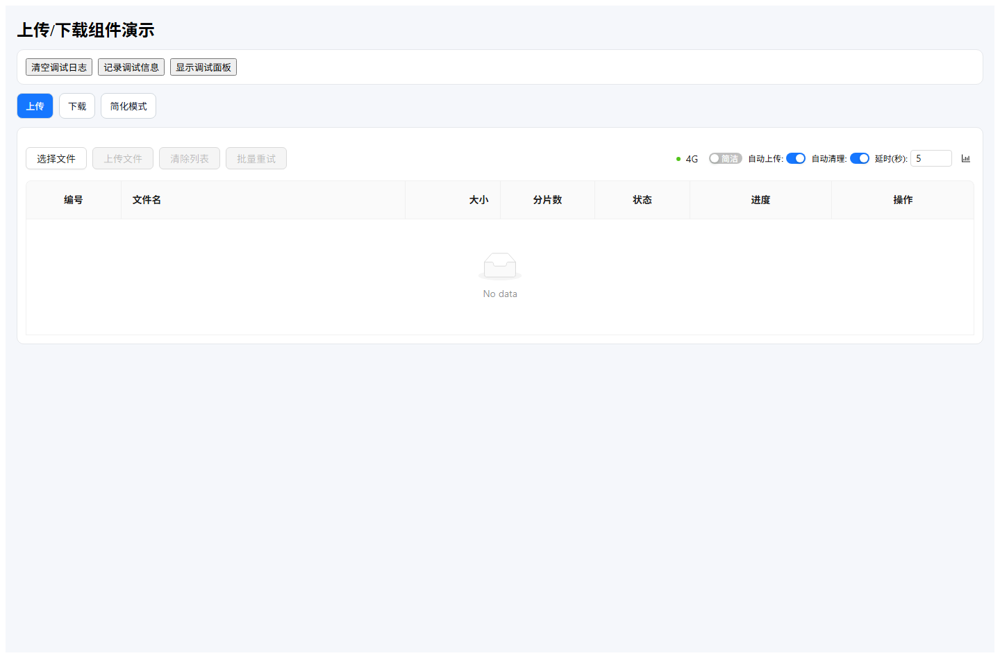
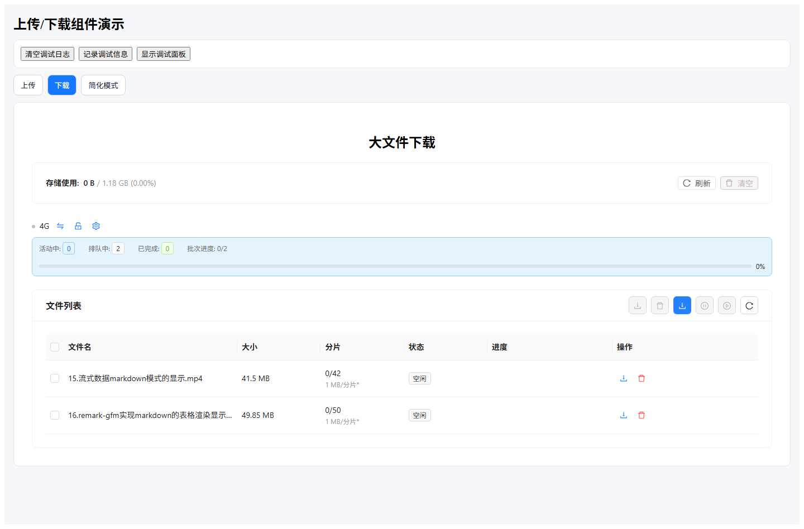
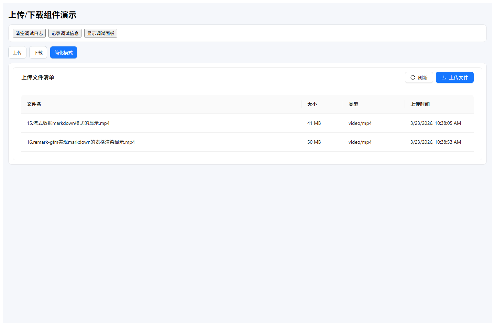
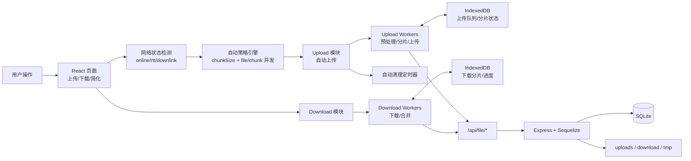
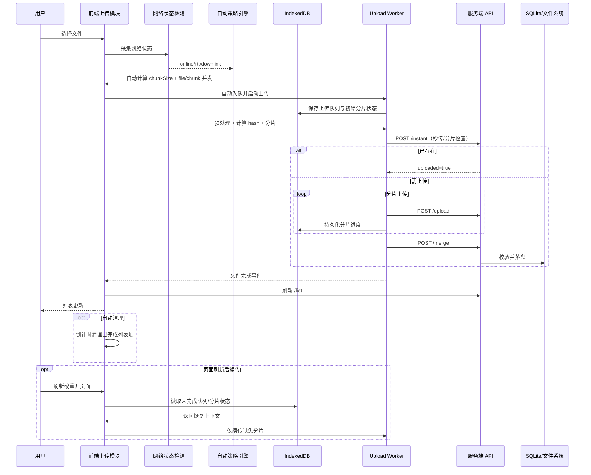
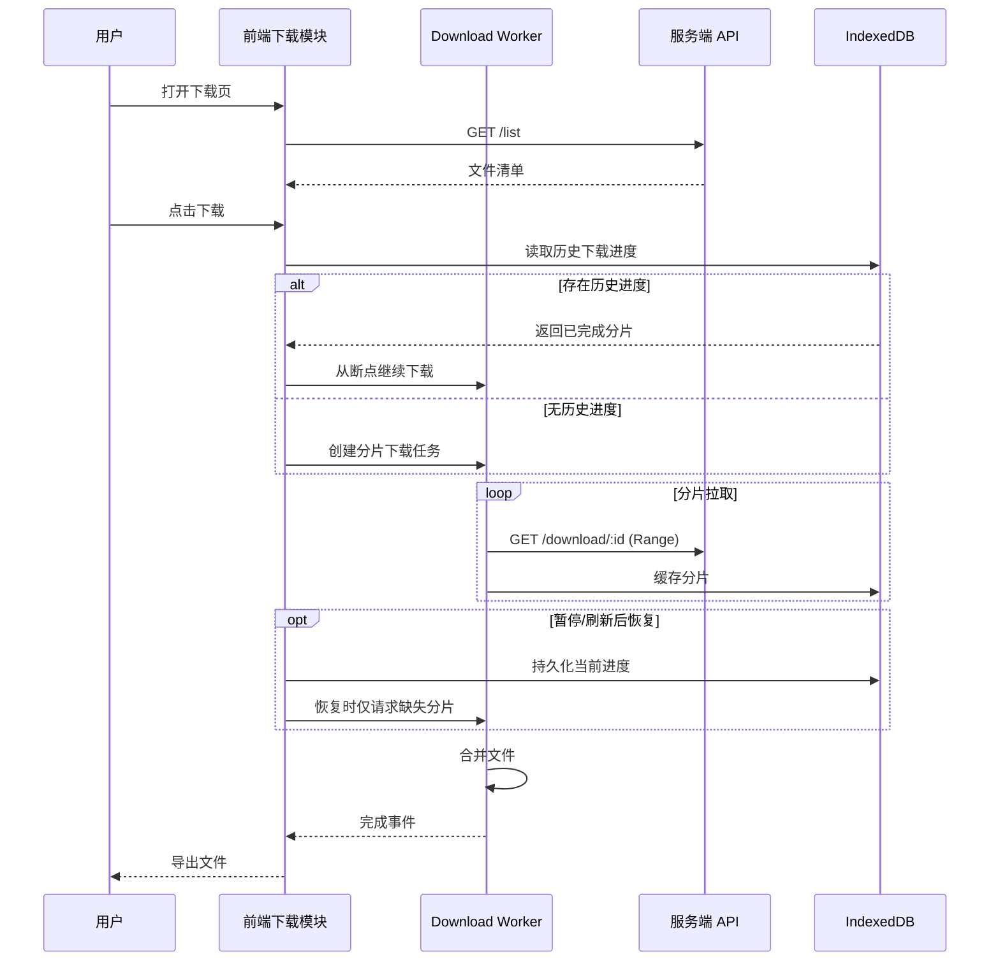

# react-upload-indexeddb

一个基于 `IndexedDB + 分片传输` 的大文件上传/下载演示项目，前后端统一使用 `/api/file/*` 协议，支持断点续传、秒传检查、分片下载、简化上传模式和调试日志面板。

## 项目目标

- 给新接手开发者提供可快速启动、可验证、可扩展的上传/下载演示基线
- 展示前端 IndexedDB 持久化 + Worker 分片处理 + 后端 SQLite 落盘的端到端链路
- 在“完整模式”之外提供“简化模式”，便于后续业务页面快速集成

## 核心能力

- 自动策略引擎：自动检测网络状态（online/offline/rtt/downlink），动态计算分片大小与并发度
- 完整上传模式：分片上传、秒传检查、失败重试、自动上传、批次进度
- 自动清理机制：上传完成后自动倒计时清理；简化模式批次结束时立即清理弹窗列表
- IndexedDB 持久化：上传队列、分片状态、下载分片与任务进度本地存储
- 刷新可续传：页面刷新/重开后自动恢复未完成任务并续传
- 下载模式：文件列表、分片下载、暂停/恢复、合并导出
- 简化模式：服务器文件清单 + 弹窗自动上传（上传后即时刷新清单）
- 统一文件名语义：列表和下载优先展示原始文件名（非物理存储名）
- 调试面板：前端日志记录、导出、问题排查辅助

## 界面示意

> 可通过 `npm run docs:screenshot` 重新生成以下截图（默认访问 `http://127.0.0.1:5173`）。

### 上传模式



完整上传链路与上传队列操作入口。

### 下载模式



服务器文件列表与分片下载控制入口。

### 简化模式



面向集成场景的最小操作界面：上传按钮 + 自动流程。

## 流程图（Mermaid 摘要）

### 架构总览



前端在“网络检测 + 自动策略 + IndexedDB 持久化”协同下执行上传/下载，后端负责分片状态、文件合并和文件列表聚合。

### 上传时序



上传链路中自动上传、自动清理、IndexedDB 持久化与刷新续传是同一条闭环能力。

### 下载时序



下载流程基于 IndexedDB 分片缓存实现暂停/恢复与刷新续传。

## 快速开始

## 环境要求

- Node.js 18+
- npm 9+

## 安装依赖

```bash
npm install
npm --prefix server install
```

## 启动服务

```bash
# 终端 1：后端
npm run server:dev

# 终端 2：前端
npm run dev
```

默认访问：

- 前端：`http://127.0.0.1:5173`
- 后端：`http://127.0.0.1:3000`

## 首次验证建议

1. 打开“上传”页上传一个文件，确认上传完成。
2. 切换“下载”页，确认新文件可见并可下载。
3. 切换“简化模式”，通过弹窗上传并观察清单即时刷新。

## 常用命令

| 命令                       | 说明                           |
| -------------------------- | ------------------------------ |
| `npm run dev`              | 启动前端开发服务               |
| `npm run server:dev`       | 启动后端服务                   |
| `npm run test:unit`        | 前端单元测试                   |
| `npm --prefix server test` | 后端集成测试                   |
| `npm run build`            | 前端构建（含 TypeScript 校验） |
| `npm run verify`           | 前后端联合验证                 |
| `npm run docs:screenshot`  | 生成 README 页面截图           |
| `npm run metrics:collect`  | 采集重构指标                   |

## 环境变量

参考根目录 `.env.example`：

- `VITE_API_BASE_URL`：前端 API 基础地址（生产/直连时使用）
- `VITE_DEV_API_PROXY_TARGET`：开发代理目标（默认 `http://localhost:3000`）

## SQLite UI 管理（可选）

如需可视化查看/排查服务端数据库，推荐使用 `DB Browser for SQLite`：

- 下载地址：https://sqlitebrowser.org/dl/
- 默认数据库文件：`server/data/indexeddb-upload.sqlite`
- 自定义数据库文件：可通过后端环境变量 `DB_STORAGE` 指定

建议操作：

1. 停止后端服务后再打开数据库，避免写锁冲突。
2. 在工具中打开 `server/data/indexeddb-upload.sqlite` 查看 `files` 与 `file_chunks` 表。
3. 若看到 `*.sqlite-wal` / `*.sqlite-shm` 文件，属于 SQLite WAL 正常产物。

## API 概览

统一前缀：`/api/file/*`

- 上传链路：`POST /instant`、`POST /upload`、`POST /merge`、`GET /status`
- 下载链路：`GET /list`、`GET /download/:file_id`

完整契约请查看：[docs/server-api-contract.md](./docs/server-api-contract.md)

## 目录导览

```text
src/                                  前端应用与上传/下载组件
server/                               后端服务（Express + SQLite + Sequelize）
docs/                                 交付文档、契约说明、架构说明
scripts/                              校验与辅助脚本（含 README 截图脚本）
```

## 已知限制与边界

- 当前以演示与集成为主，未接入完整鉴权/权限体系
- 生产级场景仍需补充：高并发压测、审计日志、容灾和安全加固
- README 截图为一次性生成，UI 改动后需手动重拍

## 常见问题

### 1) 列表显示为物理存储名（hash）

后端已优先映射原始文件名；若仍异常，请确认后端已重启并刷新页面。

### 2) 本地看不到 Mermaid 图

请使用支持 Mermaid 的 Markdown 预览（如 GitHub 或 VS Code Mermaid 扩展）。

### 3) `docs:screenshot` 执行失败

- 确认前端页面可访问（默认 `http://127.0.0.1:5173`）
- 如端口不同，可设置 `README_SCREENSHOT_BASE_URL` 再执行脚本

## 文档索引

- 扩展文档索引（职责总览与阅读顺序）：[docs/README.md](./docs/README.md)
- 组件使用文档（Props / 回调 / 集成示例）：[docs/components.md](./docs/components.md)
- 架构详图与说明（流程图 / 时序图 / 自动策略）：[docs/architecture.md](./docs/architecture.md)
- API 契约（请求响应结构与错误语义）：[docs/server-api-contract.md](./docs/server-api-contract.md)
- 演示脚本（演示步骤 / 预期结果 / 验收模板）：[docs/demo-script.md](./docs/demo-script.md)
- 面试题库（项目亮点 / 常见追问 / 参考答案）：[docs/interview.md](./docs/interview.md)
