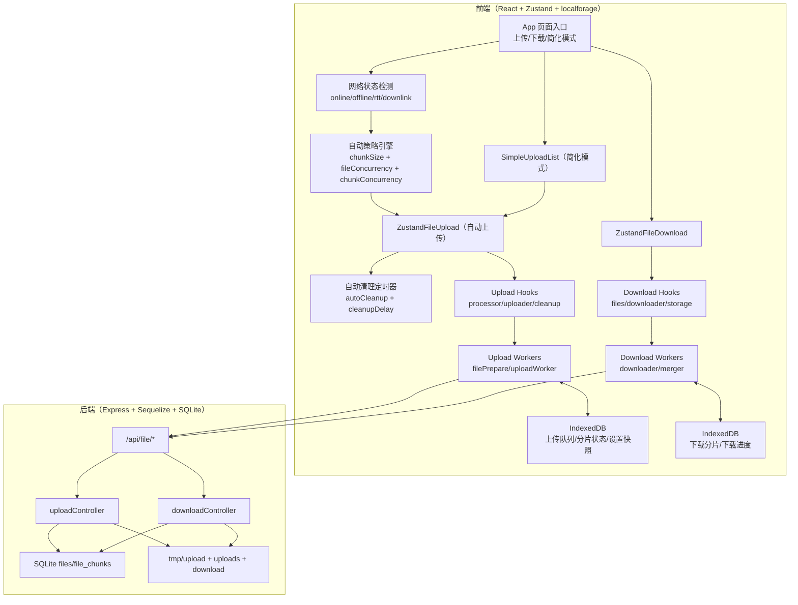
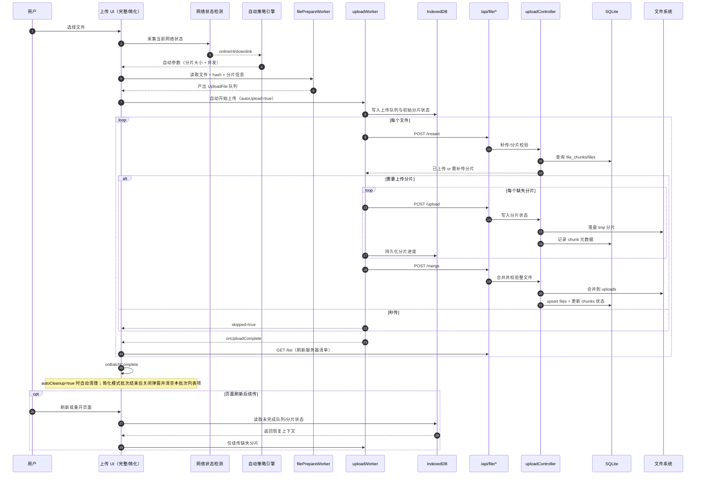
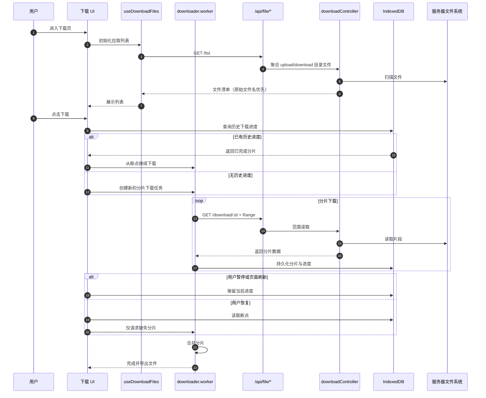
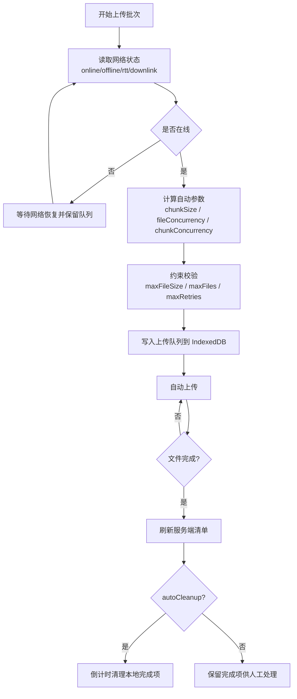
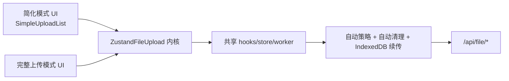

# 架构说明（含 Mermaid 详图）

本文是根 README 的架构补充，重点说明以下特色能力如何形成闭环：

## 文档职责

- 负责：系统模块关系、上传/下载链路、自动策略与续传机制的流程/时序说明。
- 不负责：组件逐项 Props 解释与 API 字段级契约字典。

- 自动检测网络状态
- 自动计算分片大小与并发
- 自动上传与自动清理
- IndexedDB 持久化存储
- 页面刷新后自动续传

## 1. 系统总览

## 2. 上传链路（完整/简化共享内核）

### 上传链路关键点

- 自动策略与上传逻辑解耦：网络采样变化只影响策略参数，不破坏上传协议。
- `instant + upload + merge` 维持一致事务语义：先校验、再补传、最后合并校验。
- 上传进度持续写入 IndexedDB，保证刷新后可恢复而不是重传整文件。
- 自动清理在 UI 层执行，避免影响服务端文件清单与后续集成。

## 3. 下载链路

### 下载链路关键点

- 下载使用 `Range` 请求，天然支持断点续传。
- 下载分片与进度写入 IndexedDB，暂停/刷新不会丢失上下文。
- 文件列表统一来自 `/api/file/list`，包含上传与下载目录聚合结果。

## 4. 自动策略决策流（上传）

## 5. 简化模式与完整模式关系

- 简化模式不维护第二套上传内核，只收敛 UI 操作复杂度。
- 完整模式保留参数调节和诊断能力；简化模式固定自动策略，适合集成页面。
