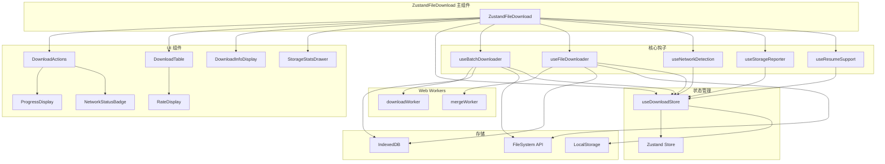
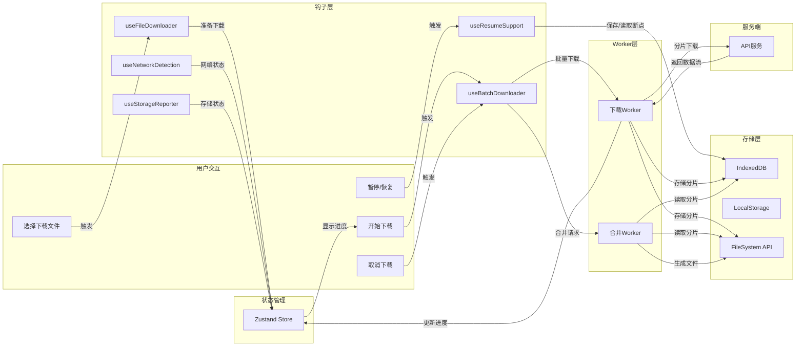
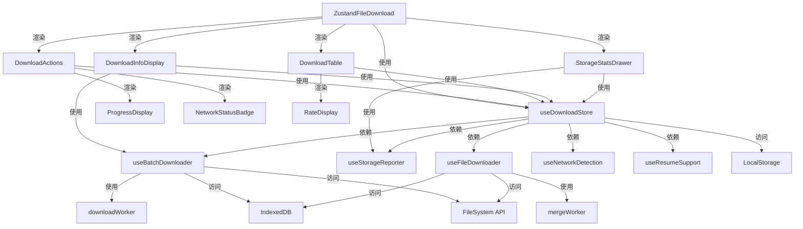
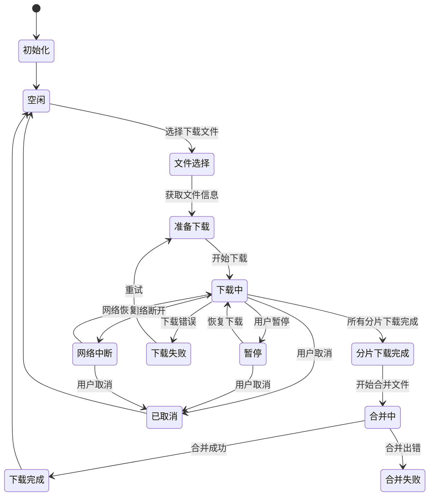
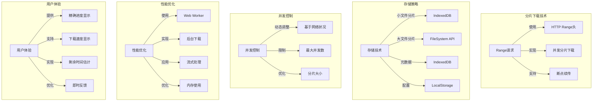
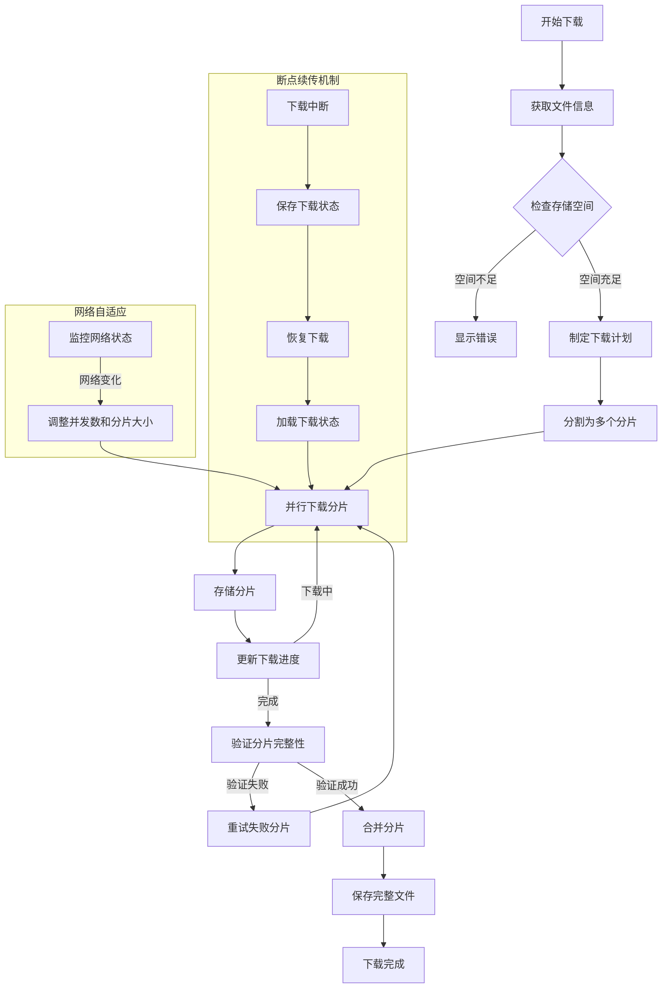
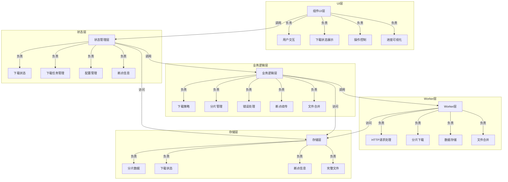

# ZustandFileDownload 组件架构图

## 组件结构图

```mermaid
graph TD
    subgraph "ZustandFileDownload 主组件"
        ZFD[ZustandFileDownload]
    end

    subgraph "UI 组件"
        DA[DownloadActions]
        DT[DownloadTable]
        DID[DownloadInfoDisplay]
        PPD[ProgressDisplay]
        NSB[NetworkStatusBadge]
        SSD[StorageStatsDrawer]
        RD[RateDisplay]
    end

    subgraph "状态管理"
        ZS[Zustand Store]
        DS[useDownloadStore]
    end

    subgraph "核心钩子"
        BD[useBatchDownloader]
        FD[useFileDownloader]
        ND[useNetworkDetection]
        SR[useStorageReporter]
        RS[useResumeSupport]
    end

    subgraph "Web Workers"
        DW[downloadWorker]
        MW[mergeWorker]
    end

    subgraph "存储"
        IDB[IndexedDB]
        LS[LocalStorage]
        FS[FileSystem API]
    end

    ZFD --> DA
    ZFD --> DT
    ZFD --> DID
    ZFD --> SSD

    DA --> PPD
    DA --> NSB
    DT --> RD

    ZFD --> DS
    DS --> ZS

    ZFD --> BD
    ZFD --> FD
    ZFD --> ND
    ZFD --> SR
    ZFD --> RS

    BD --> DW
    FD --> MW

    BD --> IDB
    FD --> IDB
    BD --> FS
    FD --> FS

    DS --> LS

    BD --> DS
    FD --> DS
    ND --> DS
    SR --> DS
    RS --> DS
```

## 数据流图

```mermaid
flowchart LR
    subgraph "用户交互"
        UI1[选择下载文件]
        UI2[开始下载]
        UI3[暂停/恢复]
        UI4[取消下载]
    end

    subgraph "状态管理"
        ZS[Zustand Store]
    end

    subgraph "钩子层"
        BD[useBatchDownloader]
        FD[useFileDownloader]
        ND[useNetworkDetection]
        SR[useStorageReporter]
        RS[useResumeSupport]
    end

    subgraph "Worker层"
        DW[下载Worker]
        MW[合并Worker]
    end

    subgraph "存储层"
        IDB[IndexedDB]
        LS[LocalStorage]
        FS[FileSystem API]
    end

    subgraph "服务端"
        API[API服务]
    end

    UI1 -->|触发| FD
    UI2 -->|触发| BD
    UI3 -->|触发| RS
    UI4 -->|触发| BD

    FD -->|准备下载| ZS
    BD -->|批量下载| DW
    RS -->|保存/读取断点| IDB

    DW -->|分片下载| API
    API -->|返回数据流| DW
    DW -->|存储分片| IDB
    DW -->|存储分片| FS

    DW -->|更新进度| ZS
    ZS -->|显示进度| UI2

    BD -->|合并请求| MW
    MW -->|读取分片| IDB
    MW -->|读取分片| FS
    MW -->|生成文件| FS

    ND -->|网络状态| ZS
    SR -->|存储状态| ZS
```

## 组件依赖图

```mermaid
graph TD
    ZFD[ZustandFileDownload] -->|使用| DS[useDownloadStore]
    ZFD -->|渲染| DA[DownloadActions]
    ZFD -->|渲染| DT[DownloadTable]
    ZFD -->|渲染| DID[DownloadInfoDisplay]
    ZFD -->|渲染| SSD[StorageStatsDrawer]

    DA -->|使用| DS
    DA -->|渲染| PPD[ProgressDisplay]
    DA -->|渲染| NSB[NetworkStatusBadge]

    DT -->|使用| DS
    DT -->|渲染| RD[RateDisplay]

    DID -->|使用| DS
    DID -->|使用| BD[useBatchDownloader]

    SSD -->|使用| DS
    SSD -->|使用| SR[useStorageReporter]

    DS -->|依赖| BD
    DS -->|依赖| FD[useFileDownloader]
    DS -->|依赖| ND[useNetworkDetection]
    DS -->|依赖| SR
    DS -->|依赖| RS[useResumeSupport]

    BD -->|使用| DW[downloadWorker]
    FD -->|使用| MW[mergeWorker]

    BD -->|访问| IDB[IndexedDB]
    FD -->|访问| IDB
    BD -->|访问| FS[FileSystem API]
    FD -->|访问| FS

    DS -->|访问| LS[LocalStorage]
```

## 状态管理图

```mermaid
stateDiagram-v2
    [*] --> 初始化
    初始化 --> 空闲

    空闲 --> 文件选择: 选择下载文件
    文件选择 --> 准备下载: 获取文件信息

    准备下载 --> 下载中: 开始下载
    下载中 --> 暂停: 用户暂停
    暂停 --> 下载中: 恢复下载

    下载中 --> 网络中断: 网络断开
    网络中断 --> 下载中: 网络恢复

    下载中 --> 分片下载完成: 所有分片下载完成
    分片下载完成 --> 合并中: 开始合并文件
    合并中 --> 下载完成: 合并成功
    合并中 --> 合并失败: 合并出错

    下载中 --> 下载失败: 下载错误
    下载失败 --> 准备下载: 重试

    下载中 --> 已取消: 用户取消
    暂停 --> 已取消: 用户取消
    网络中断 --> 已取消: 用户取消

    下载完成 --> 空闲
    已取消 --> 空闲
```

## 技术实现关键点

```mermaid
graph TD
    subgraph "分片下载技术"
        RD[Range请求]
        RD -->|使用| H1["HTTP Range头"]
        RD -->|实现| C1["并发分片下载"]
        RD -->|支持| C2["断点续传"]
    end

    subgraph "存储策略"
        ST[存储技术]
        ST -->|小文件分片| I1["IndexedDB"]
        ST -->|大文件分片| F1["FileSystem API"]
        ST -->|元数据| I2["IndexedDB"]
        ST -->|配置| L1["LocalStorage"]
    end

    subgraph "并发控制"
        CC[并发控制]
        CC -->|动态调整| D1["基于网络状况"]
        CC -->|限制| D2["最大并发数"]
        CC -->|优化| D3["分片大小"]
    end

    subgraph "性能优化"
        PO[性能优化]
        PO -->|使用| W1["Web Worker"]
        PO -->|实现| W2["后台下载"]
        PO -->|应用| W3["流式处理"]
        PO -->|优化| W4["内存使用"]
    end

    subgraph "用户体验"
        UX[用户体验]
        UX -->|提供| U1["精确进度显示"]
        UX -->|支持| U2["下载速度显示"]
        UX -->|实现| U3["剩余时间估计"]
        UX -->|优化| U4["即时反馈"]
    end
```

## 超大文件下载流程

```mermaid
flowchart TD
    Start[开始下载] --> Info[获取文件信息]
    Info --> Check{检查存储空间}

    Check -->|空间不足| Error[显示错误]
    Check -->|空间充足| Plan[制定下载计划]

    Plan --> Split[分割为多个分片]
    Split --> Parallel[并行下载分片]

    Parallel --> Store[存储分片]
    Store --> Progress[更新下载进度]

    Progress -->|下载中| Parallel
    Progress -->|完成| Verify[验证分片完整性]

    Verify -->|验证失败| Retry[重试失败分片]
    Retry --> Parallel

    Verify -->|验证成功| Merge[合并分片]
    Merge --> Save[保存完整文件]
    Save --> Complete[下载完成]

    subgraph "断点续传机制"
        Break[下载中断] --> SaveState[保存下载状态]
        SaveState --> Resume[恢复下载]
        Resume --> LoadState[加载下载状态]
        LoadState --> Parallel
    end

    subgraph "网络自适应"
        Monitor[监控网络状态]
        Monitor -->|网络变化| Adjust[调整并发数和分片大小]
        Adjust --> Parallel
    end
```

## 模块职责图

```mermaid
graph TD
    subgraph "UI层"
        UI[组件UI层]
        UI -->|负责| UI1[用户交互]
        UI -->|负责| UI2[下载状态展示]
        UI -->|负责| UI3[操作控制]
        UI -->|负责| UI4[进度可视化]
    end

    subgraph "状态层"
        SM[状态管理层]
        SM -->|负责| SM1[下载状态]
        SM -->|负责| SM2[下载任务管理]
        SM -->|负责| SM3[配置管理]
        SM -->|负责| SM4[断点信息]
    end

    subgraph "业务逻辑层"
        BL[业务逻辑层]
        BL -->|负责| BL1[下载策略]
        BL -->|负责| BL2[分片管理]
        BL -->|负责| BL3[错误处理]
        BL -->|负责| BL4[断点续传]
        BL -->|负责| BL5[文件合并]
    end

    subgraph "Worker层"
        WK[Worker层]
        WK -->|负责| WK1[HTTP请求处理]
        WK -->|负责| WK2[分片下载]
        WK -->|负责| WK3[数据存储]
        WK -->|负责| WK4[文件合并]
    end

    subgraph "存储层"
        ST[存储层]
        ST -->|负责| ST1[分片数据]
        ST -->|负责| ST2[下载状态]
        ST -->|负责| ST3[断点信息]
        ST -->|负责| ST4[完整文件]
    end

    UI -->|调用| SM
    SM -->|调用| BL
    BL -->|调用| WK
    BL -->|访问| ST
    SM -->|访问| ST
    WK -->|访问| ST
```
