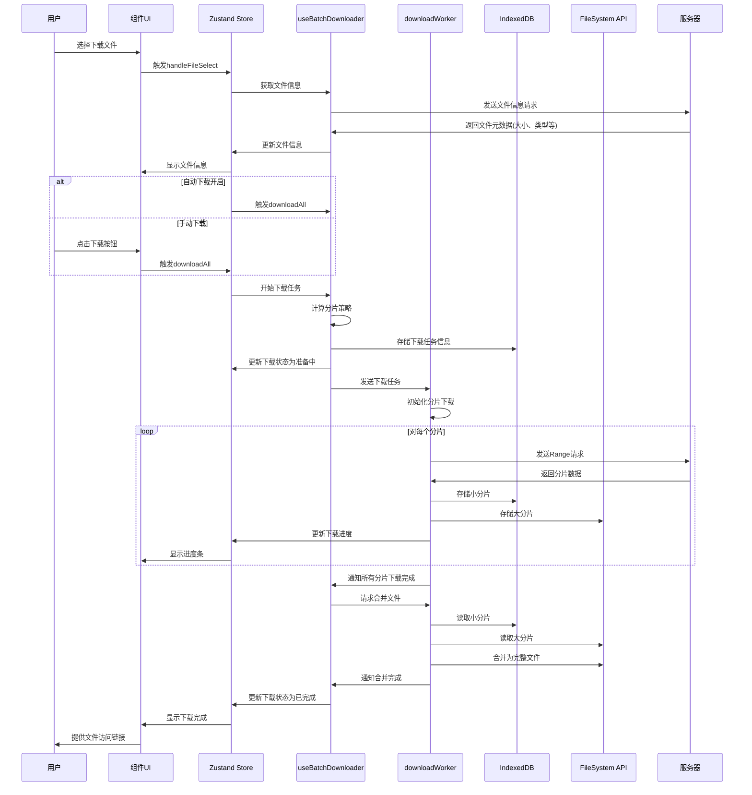
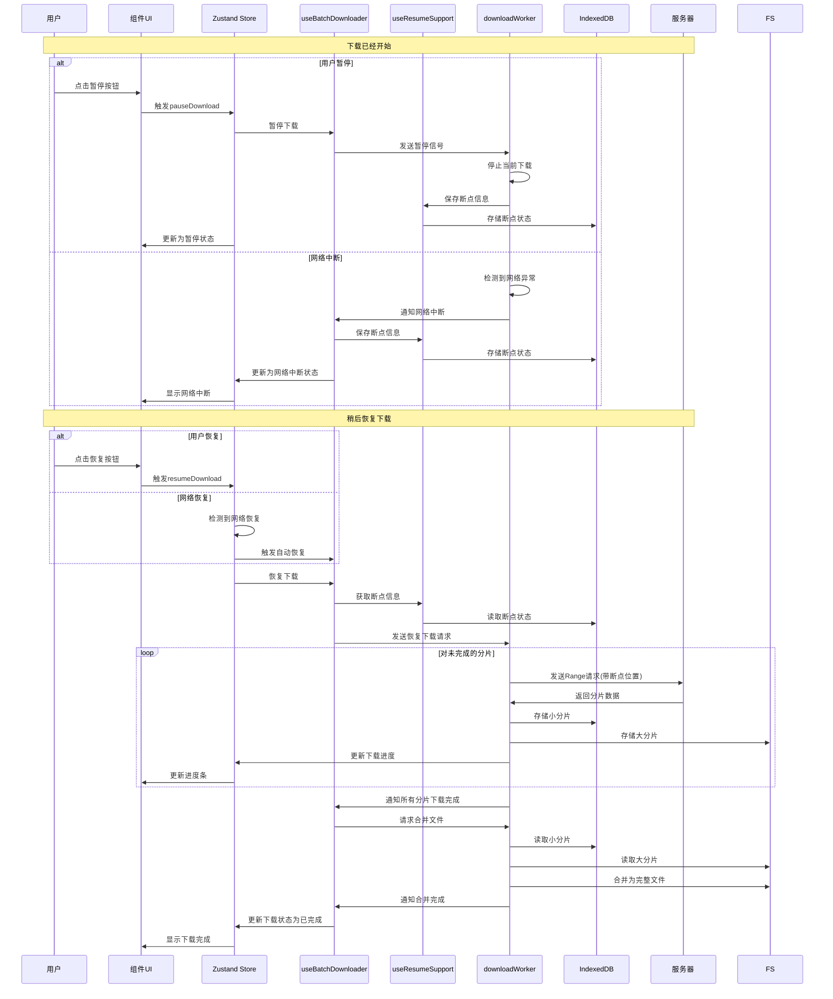
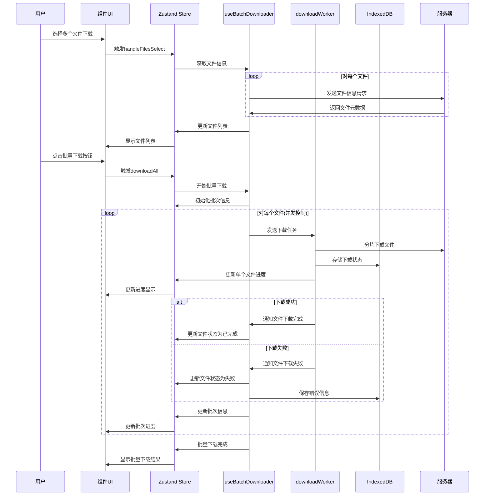
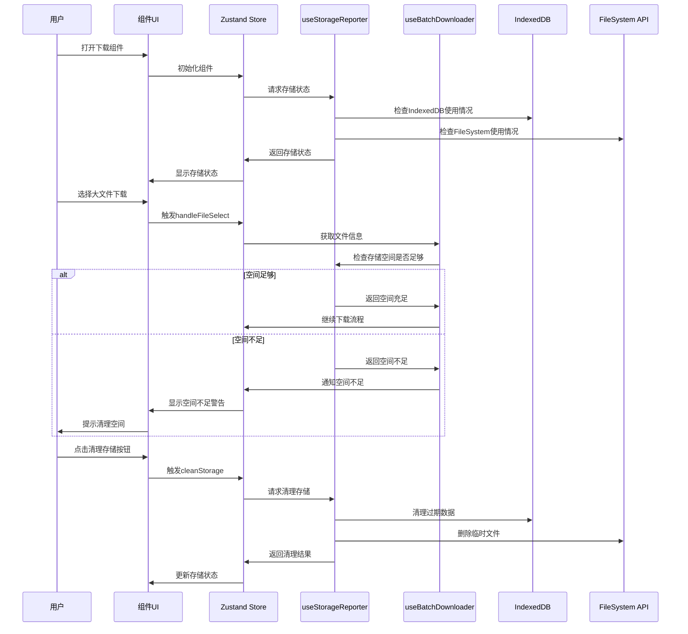
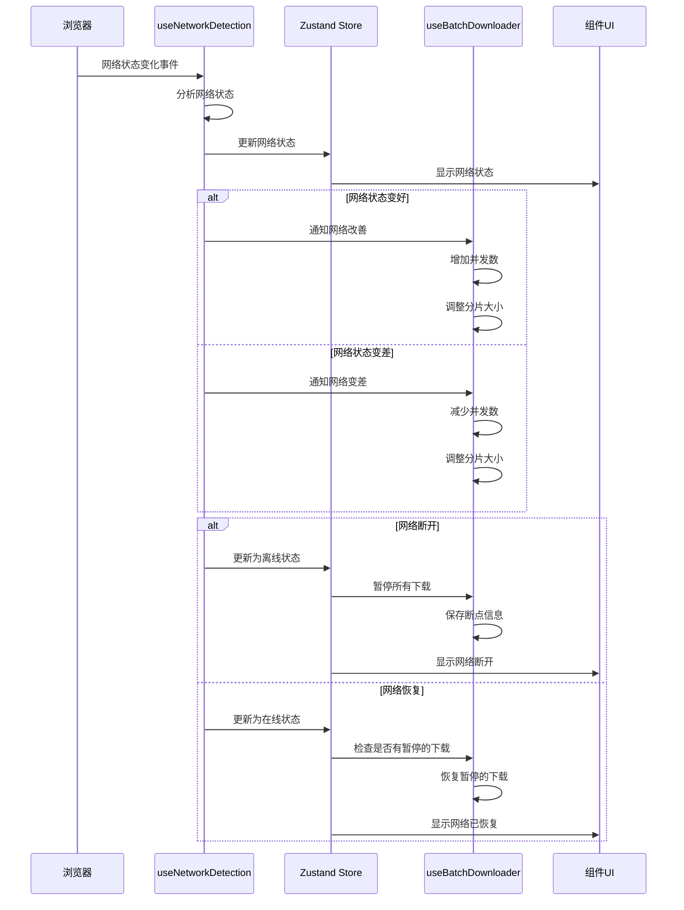
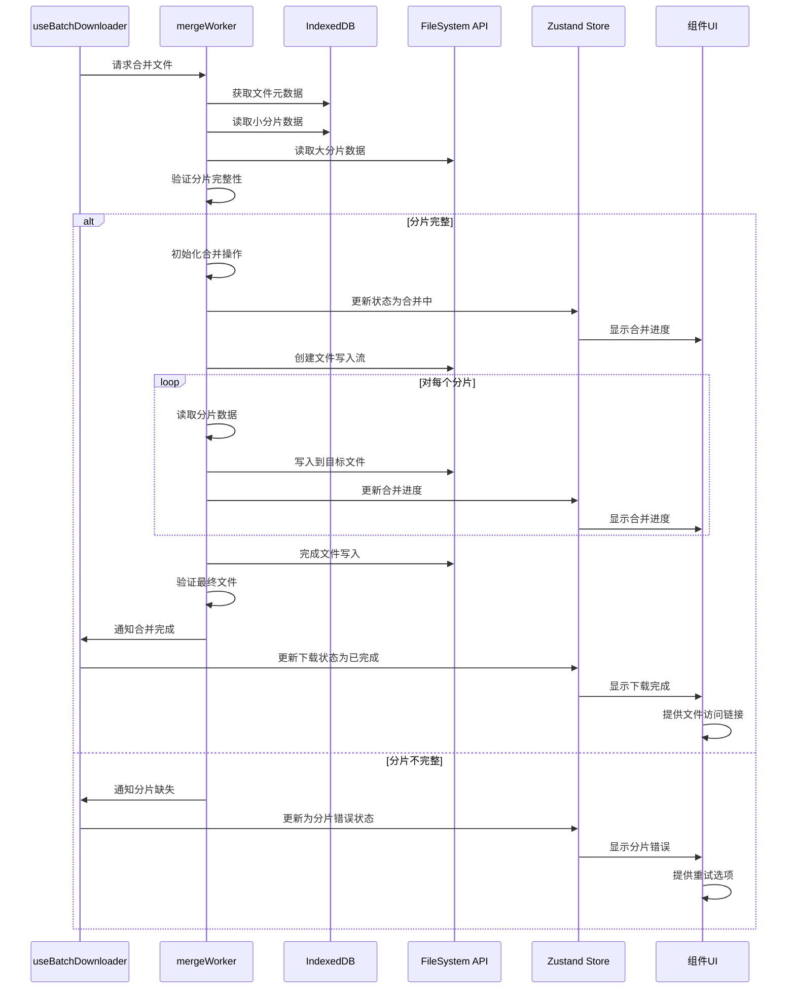
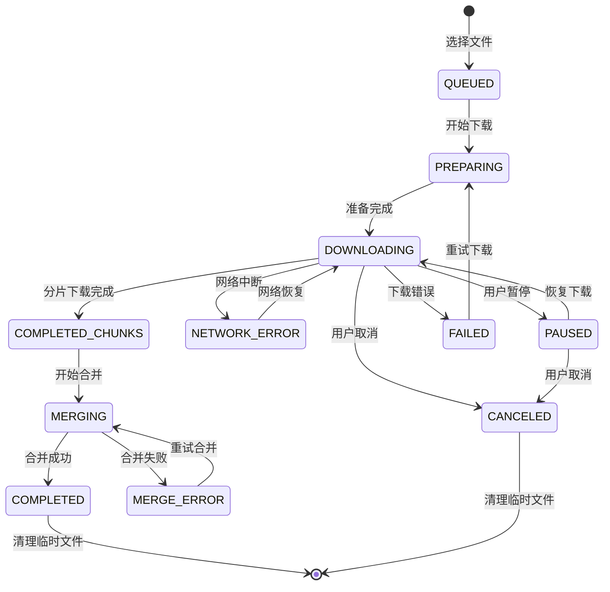
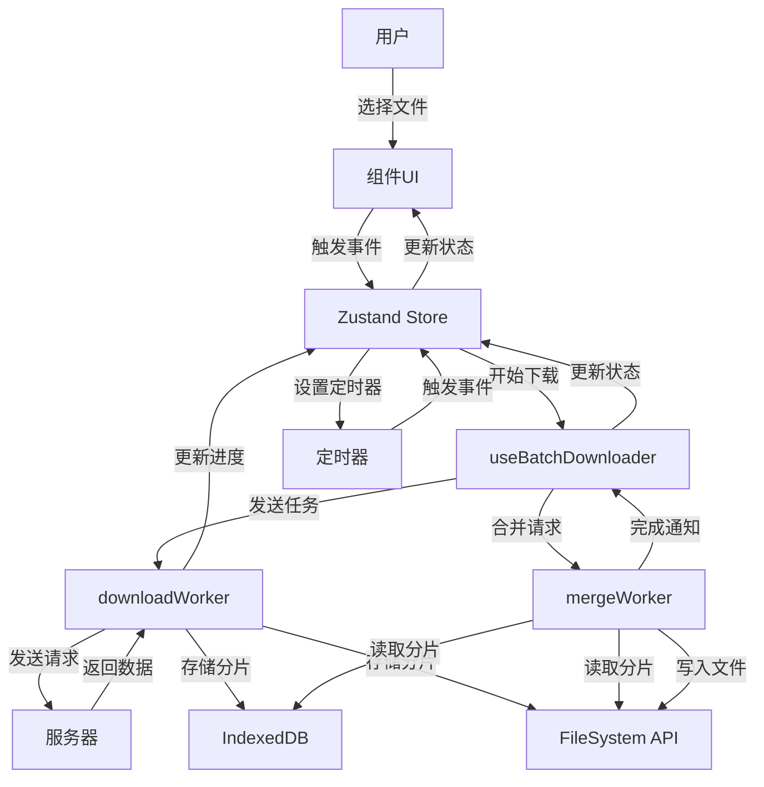

# ZustandFileDownload 组件时序图

## 文件下载流程

```mermaid
sequenceDiagram
    participant User as 用户
    participant UI as 组件UI
    participant Store as Zustand Store
    participant BD as useBatchDownloader
    participant DW as downloadWorker
    participant IDB as IndexedDB
    participant FS as FileSystem API
    participant Server as 服务器

    User->>UI: 选择下载文件
    UI->>Store: 触发handleFileSelect
    Store->>BD: 获取文件信息
    BD->>Server: 发送文件信息请求
    Server->>BD: 返回文件元数据(大小、类型等)
    BD->>Store: 更新文件信息
    Store->>UI: 显示文件信息

    alt 自动下载开启
        Store->>BD: 触发downloadAll
    else 手动下载
        User->>UI: 点击下载按钮
        UI->>Store: 触发downloadAll
    end

    Store->>BD: 开始下载任务
    BD->>BD: 计算分片策略
    BD->>IDB: 存储下载任务信息
    BD->>Store: 更新下载状态为准备中

    BD->>DW: 发送下载任务
    DW->>DW: 初始化分片下载

    loop 对每个分片
        DW->>Server: 发送Range请求
        Server->>DW: 返回分片数据
        DW->>IDB: 存储小分片
        DW->>FS: 存储大分片
        DW->>Store: 更新下载进度
        Store->>UI: 显示进度条
    end

    DW->>BD: 通知所有分片下载完成
    BD->>DW: 请求合并文件
    DW->>IDB: 读取小分片
    DW->>FS: 读取大分片
    DW->>FS: 合并为完整文件
    DW->>BD: 通知合并完成
    BD->>Store: 更新下载状态为已完成
    Store->>UI: 显示下载完成
    UI->>User: 提供文件访问链接
```

## 断点续传流程

```mermaid
sequenceDiagram
    participant User as 用户
    participant UI as 组件UI
    participant Store as Zustand Store
    participant BD as useBatchDownloader
    participant RS as useResumeSupport
    participant DW as downloadWorker
    participant IDB as IndexedDB
    participant Server as 服务器

    Note over User,Server: 下载已经开始

    alt 用户暂停
        User->>UI: 点击暂停按钮
        UI->>Store: 触发pauseDownload
        Store->>BD: 暂停下载
        BD->>DW: 发送暂停信号
        DW->>DW: 停止当前下载
        DW->>RS: 保存断点信息
        RS->>IDB: 存储断点状态
        Store->>UI: 更新为暂停状态
    else 网络中断
        DW->>DW: 检测到网络异常
        DW->>BD: 通知网络中断
        BD->>RS: 保存断点信息
        RS->>IDB: 存储断点状态
        BD->>Store: 更新为网络中断状态
        Store->>UI: 显示网络中断
    end

    Note over User,Server: 稍后恢复下载

    alt 用户恢复
        User->>UI: 点击恢复按钮
        UI->>Store: 触发resumeDownload
    else 网络恢复
        Store->>Store: 检测到网络恢复
        Store->>BD: 触发自动恢复
    end

    Store->>BD: 恢复下载
    BD->>RS: 获取断点信息
    RS->>IDB: 读取断点状态
    BD->>DW: 发送恢复下载请求

    loop 对未完成的分片
        DW->>Server: 发送Range请求(带断点位置)
        Server->>DW: 返回分片数据
        DW->>IDB: 存储小分片
        DW->>FS: 存储大分片
        DW->>Store: 更新下载进度
        Store->>UI: 更新进度条
    end

    DW->>BD: 通知所有分片下载完成
    BD->>DW: 请求合并文件
    DW->>IDB: 读取小分片
    DW->>FS: 读取大分片
    DW->>FS: 合并为完整文件
    DW->>BD: 通知合并完成
    BD->>Store: 更新下载状态为已完成
    Store->>UI: 显示下载完成
```

## 批量下载流程

```mermaid
sequenceDiagram
    participant User as 用户
    participant UI as 组件UI
    participant Store as Zustand Store
    participant BD as useBatchDownloader
    participant DW as downloadWorker
    participant IDB as IndexedDB
    participant Server as 服务器

    User->>UI: 选择多个文件下载
    UI->>Store: 触发handleFilesSelect
    Store->>BD: 获取文件信息

    loop 对每个文件
        BD->>Server: 发送文件信息请求
        Server->>BD: 返回文件元数据
    end

    BD->>Store: 更新文件列表
    Store->>UI: 显示文件列表

    User->>UI: 点击批量下载按钮
    UI->>Store: 触发downloadAll
    Store->>BD: 开始批量下载

    BD->>Store: 初始化批次信息

    loop 对每个文件(并发控制)
        BD->>DW: 发送下载任务
        DW->>Server: 分片下载文件
        DW->>IDB: 存储下载状态
        DW->>Store: 更新单个文件进度
        Store->>UI: 更新进度显示

        alt 下载成功
            DW->>BD: 通知文件下载完成
            BD->>Store: 更新文件状态为已完成
        else 下载失败
            DW->>BD: 通知文件下载失败
            BD->>Store: 更新文件状态为失败
            BD->>IDB: 保存错误信息
        end

        BD->>Store: 更新批次信息
        Store->>UI: 更新批次进度
    end

    BD->>Store: 批量下载完成
    Store->>UI: 显示批量下载结果
```

## 存储空间管理流程

```mermaid
sequenceDiagram
    participant User as 用户
    participant UI as 组件UI
    participant Store as Zustand Store
    participant SR as useStorageReporter
    participant BD as useBatchDownloader
    participant IDB as IndexedDB
    participant FS as FileSystem API

    User->>UI: 打开下载组件
    UI->>Store: 初始化组件
    Store->>SR: 请求存储状态
    SR->>IDB: 检查IndexedDB使用情况
    SR->>FS: 检查FileSystem使用情况
    SR->>Store: 返回存储状态
    Store->>UI: 显示存储状态

    User->>UI: 选择大文件下载
    UI->>Store: 触发handleFileSelect
    Store->>BD: 获取文件信息
    BD->>SR: 检查存储空间是否足够

    alt 空间足够
        SR->>BD: 返回空间充足
        BD->>Store: 继续下载流程
    else 空间不足
        SR->>BD: 返回空间不足
        BD->>Store: 通知空间不足
        Store->>UI: 显示空间不足警告
        UI->>User: 提示清理空间
    end

    User->>UI: 点击清理存储按钮
    UI->>Store: 触发cleanStorage
    Store->>SR: 请求清理存储
    SR->>IDB: 清理过期数据
    SR->>FS: 删除临时文件
    SR->>Store: 返回清理结果
    Store->>UI: 更新存储状态
```

## 网络状态监控流程

```mermaid
sequenceDiagram
    participant Browser as 浏览器
    participant ND as useNetworkDetection
    participant Store as Zustand Store
    participant BD as useBatchDownloader
    participant UI as 组件UI

    Browser->>ND: 网络状态变化事件
    ND->>ND: 分析网络状态
    ND->>Store: 更新网络状态
    Store->>UI: 显示网络状态

    alt 网络状态变好
        ND->>BD: 通知网络改善
        BD->>BD: 增加并发数
        BD->>BD: 调整分片大小
    else 网络状态变差
        ND->>BD: 通知网络变差
        BD->>BD: 减少并发数
        BD->>BD: 调整分片大小
    end

    alt 网络断开
        ND->>Store: 更新为离线状态
        Store->>BD: 暂停所有下载
        BD->>BD: 保存断点信息
        Store->>UI: 显示网络断开
    else 网络恢复
        ND->>Store: 更新为在线状态
        Store->>BD: 检查是否有暂停的下载
        BD->>BD: 恢复暂停的下载
        Store->>UI: 显示网络已恢复
    end
```

## 文件合并流程

```mermaid
sequenceDiagram
    participant BD as useBatchDownloader
    participant MW as mergeWorker
    participant IDB as IndexedDB
    participant FS as FileSystem API
    participant Store as Zustand Store
    participant UI as 组件UI

    BD->>MW: 请求合并文件
    MW->>IDB: 获取文件元数据
    MW->>IDB: 读取小分片数据
    MW->>FS: 读取大分片数据

    MW->>MW: 验证分片完整性

    alt 分片完整
        MW->>MW: 初始化合并操作
        MW->>Store: 更新状态为合并中
        Store->>UI: 显示合并进度

        MW->>FS: 创建文件写入流

        loop 对每个分片
            MW->>MW: 读取分片数据
            MW->>FS: 写入到目标文件
            MW->>Store: 更新合并进度
            Store->>UI: 显示合并进度
        end

        MW->>FS: 完成文件写入
        MW->>MW: 验证最终文件
        MW->>BD: 通知合并完成
        BD->>Store: 更新下载状态为已完成
        Store->>UI: 显示下载完成
        UI->>UI: 提供文件访问链接
    else 分片不完整
        MW->>BD: 通知分片缺失
        BD->>Store: 更新为分片错误状态
        Store->>UI: 显示分片错误
        UI->>UI: 提供重试选项
    end
```

## 文件状态转换流程

```mermaid
stateDiagram-v2
    [*] --> QUEUED: 选择文件
    QUEUED --> PREPARING: 开始下载
    PREPARING --> DOWNLOADING: 准备完成

    DOWNLOADING --> PAUSED: 用户暂停
    PAUSED --> DOWNLOADING: 恢复下载

    DOWNLOADING --> NETWORK_ERROR: 网络中断
    NETWORK_ERROR --> DOWNLOADING: 网络恢复

    DOWNLOADING --> COMPLETED_CHUNKS: 分片下载完成
    COMPLETED_CHUNKS --> MERGING: 开始合并
    MERGING --> COMPLETED: 合并成功
    MERGING --> MERGE_ERROR: 合并失败

    DOWNLOADING --> FAILED: 下载错误
    FAILED --> PREPARING: 重试下载

    MERGE_ERROR --> MERGING: 重试合并

    DOWNLOADING --> CANCELED: 用户取消
    PAUSED --> CANCELED: 用户取消

    COMPLETED --> [*]: 清理临时文件
    CANCELED --> [*]: 清理临时文件
```

## 数据流向图

```mermaid
flowchart TD
    User[用户] -->|选择文件| UI[组件UI]
    UI -->|触发事件| Store[Zustand Store]
    Store -->|更新状态| UI

    Store -->|开始下载| BD[useBatchDownloader]
    BD -->|发送任务| DW[downloadWorker]
    DW -->|发送请求| Server[服务器]
    Server -->|返回数据| DW

    DW -->|存储分片| IDB[IndexedDB]
    DW -->|存储分片| FS[FileSystem API]

    DW -->|更新进度| Store

    BD -->|合并请求| MW[mergeWorker]
    MW -->|读取分片| IDB
    MW -->|读取分片| FS
    MW -->|写入文件| FS

    MW -->|完成通知| BD
    BD -->|更新状态| Store

    Store -->|设置定时器| Timer[定时器]
    Timer -->|触发事件| Store
```
