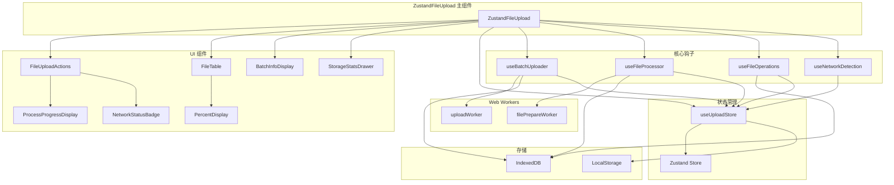
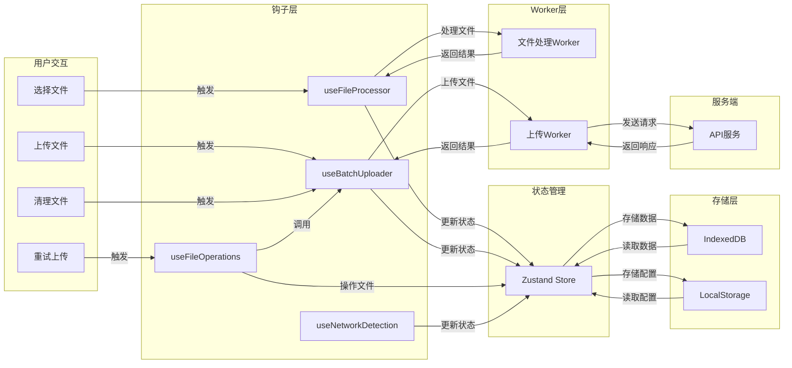
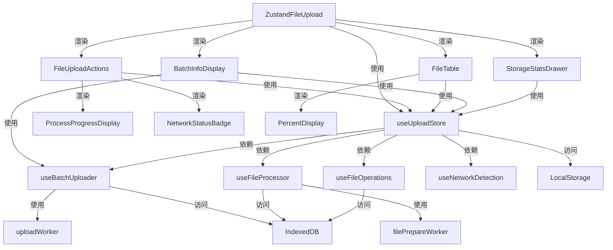
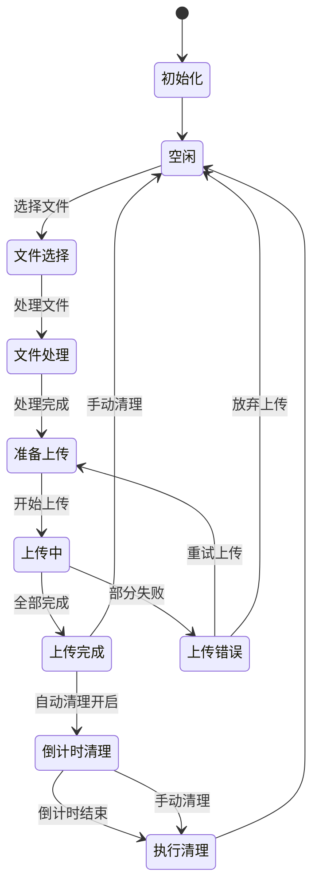
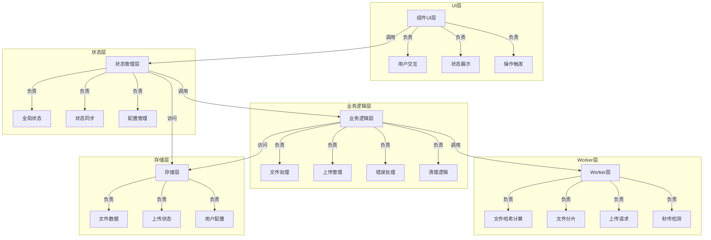

# ZustandFileUpload 组件架构图

## 组件结构图

```mermaid
graph TD
    subgraph "ZustandFileUpload 主组件"
        ZFU[ZustandFileUpload]
    end

    subgraph "UI 组件"
        FA[FileUploadActions]
        FT[FileTable]
        BID[BatchInfoDisplay]
        PPD[ProcessProgressDisplay]
        NSB[NetworkStatusBadge]
        SSD[StorageStatsDrawer]
        PD[PercentDisplay]
    end

    subgraph "状态管理"
        ZS[Zustand Store]
        US[useUploadStore]
    end

    subgraph "核心钩子"
        BU[useBatchUploader]
        FP[useFileProcessor]
        FO[useFileOperations]
        ND[useNetworkDetection]
    end

    subgraph "Web Workers"
        FPW[filePrepareWorker]
        UW[uploadWorker]
    end

    subgraph "存储"
        IDB[IndexedDB]
        LS[LocalStorage]
    end

    ZFU --> FA
    ZFU --> FT
    ZFU --> BID
    ZFU --> SSD

    FA --> PPD
    FA --> NSB
    FT --> PD

    ZFU --> US
    US --> ZS

    ZFU --> BU
    ZFU --> FP
    ZFU --> FO
    ZFU --> ND

    BU --> UW
    FP --> FPW

    BU --> IDB
    FP --> IDB
    FO --> IDB

    US --> LS

    BU --> US
    FP --> US
    FO --> US
    ND --> US
```

## 数据流图

```mermaid
flowchart LR
    subgraph "用户交互"
        UI1[选择文件]
        UI2[上传文件]
        UI3[重试上传]
        UI4[清理文件]
    end

    subgraph "状态管理"
        ZS[Zustand Store]
    end

    subgraph "钩子层"
        BU[useBatchUploader]
        FP[useFileProcessor]
        FO[useFileOperations]
        ND[useNetworkDetection]
    end

    subgraph "Worker层"
        FPW[文件处理Worker]
        UW[上传Worker]
    end

    subgraph "存储层"
        IDB[IndexedDB]
        LS[LocalStorage]
    end

    subgraph "服务端"
        API[API服务]
    end

    UI1 -->|触发| FP
    UI2 -->|触发| BU
    UI3 -->|触发| FO
    UI4 -->|触发| BU

    FP -->|处理文件| FPW
    FPW -->|返回结果| FP
    FP -->|更新状态| ZS

    BU -->|上传文件| UW
    UW -->|返回结果| BU
    BU -->|更新状态| ZS

    FO -->|操作文件| ZS
    FO -->|调用| BU

    ND -->|更新状态| ZS

    ZS -->|存储数据| IDB
    ZS -->|存储配置| LS

    IDB -->|读取数据| ZS
    LS -->|读取配置| ZS

    UW -->|发送请求| API
    API -->|返回响应| UW
```

## 组件依赖图

```mermaid
graph TD
    ZFU[ZustandFileUpload] -->|使用| US[useUploadStore]
    ZFU -->|渲染| FA[FileUploadActions]
    ZFU -->|渲染| FT[FileTable]
    ZFU -->|渲染| BID[BatchInfoDisplay]
    ZFU -->|渲染| SSD[StorageStatsDrawer]

    FA -->|使用| US
    FA -->|渲染| PPD[ProcessProgressDisplay]
    FA -->|渲染| NSB[NetworkStatusBadge]

    FT -->|使用| US
    FT -->|渲染| PD[PercentDisplay]

    BID -->|使用| US
    BID -->|使用| BU[useBatchUploader]

    SSD -->|使用| US

    US -->|依赖| BU
    US -->|依赖| FP[useFileProcessor]
    US -->|依赖| FO[useFileOperations]
    US -->|依赖| ND[useNetworkDetection]

    BU -->|使用| UW[uploadWorker]
    FP -->|使用| FPW[filePrepareWorker]

    BU -->|访问| IDB[IndexedDB]
    FP -->|访问| IDB
    FO -->|访问| IDB

    US -->|访问| LS[LocalStorage]
```

## 状态管理图

```mermaid
stateDiagram-v2
    [*] --> 初始化
    初始化 --> 空闲

    空闲 --> 文件选择: 选择文件
    文件选择 --> 文件处理: 处理文件
    文件处理 --> 准备上传: 处理完成

    准备上传 --> 上传中: 开始上传
    上传中 --> 上传完成: 全部完成
    上传中 --> 上传错误: 部分失败

    上传完成 --> 倒计时清理: 自动清理开启
    上传完成 --> 空闲: 手动清理

    上传错误 --> 准备上传: 重试上传
    上传错误 --> 空闲: 放弃上传

    倒计时清理 --> 执行清理: 倒计时结束
    倒计时清理 --> 执行清理: 手动清理
    执行清理 --> 空闲
```

## 模块职责图

```mermaid
graph TD
    subgraph "UI层"
        UI[组件UI层]
        UI -->|负责| UI1[用户交互]
        UI -->|负责| UI2[状态展示]
        UI -->|负责| UI3[操作触发]
    end

    subgraph "状态层"
        SM[状态管理层]
        SM -->|负责| SM1[全局状态]
        SM -->|负责| SM2[状态同步]
        SM -->|负责| SM3[配置管理]
    end

    subgraph "业务逻辑层"
        BL[业务逻辑层]
        BL -->|负责| BL1[文件处理]
        BL -->|负责| BL2[上传管理]
        BL -->|负责| BL3[错误处理]
        BL -->|负责| BL4[清理逻辑]
    end

    subgraph "Worker层"
        WK[Worker层]
        WK -->|负责| WK1[文件哈希计算]
        WK -->|负责| WK2[文件分片]
        WK -->|负责| WK3[上传请求]
        WK -->|负责| WK4[秒传检测]
    end

    subgraph "存储层"
        ST[存储层]
        ST -->|负责| ST1[文件数据]
        ST -->|负责| ST2[上传状态]
        ST -->|负责| ST3[用户配置]
    end

    UI -->|调用| SM
    SM -->|调用| BL
    BL -->|调用| WK
    BL -->|访问| ST
    SM -->|访问| ST
```
