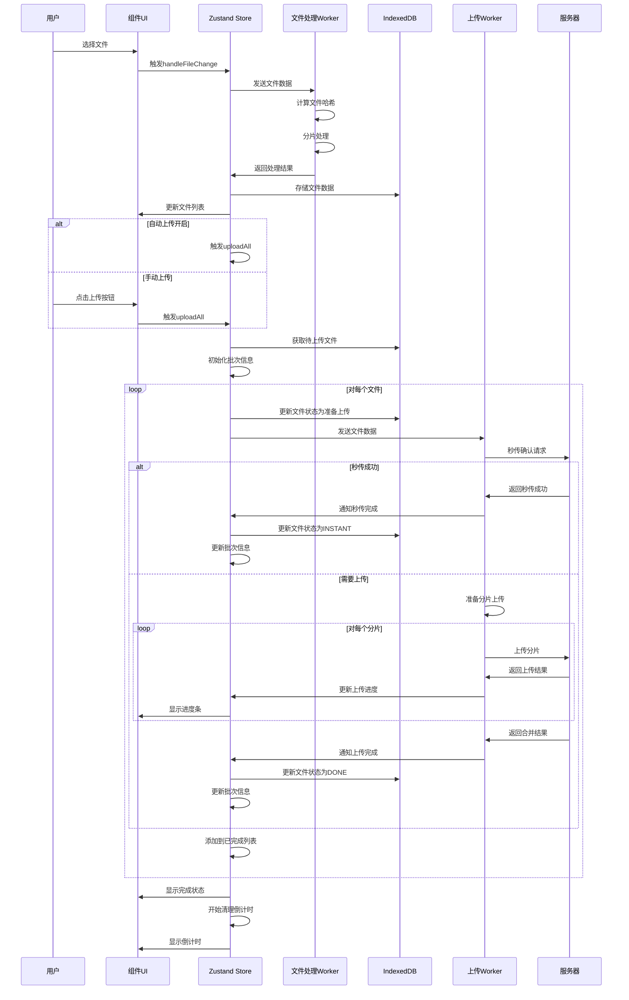
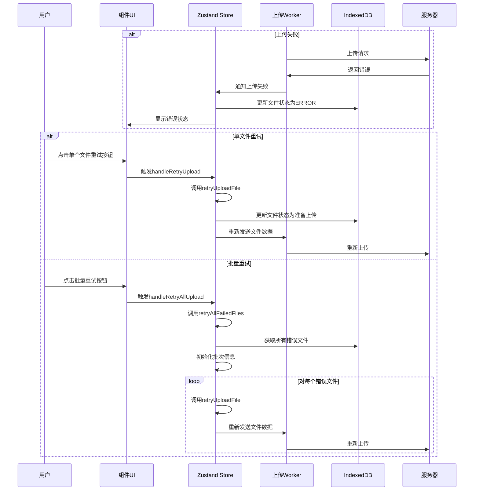
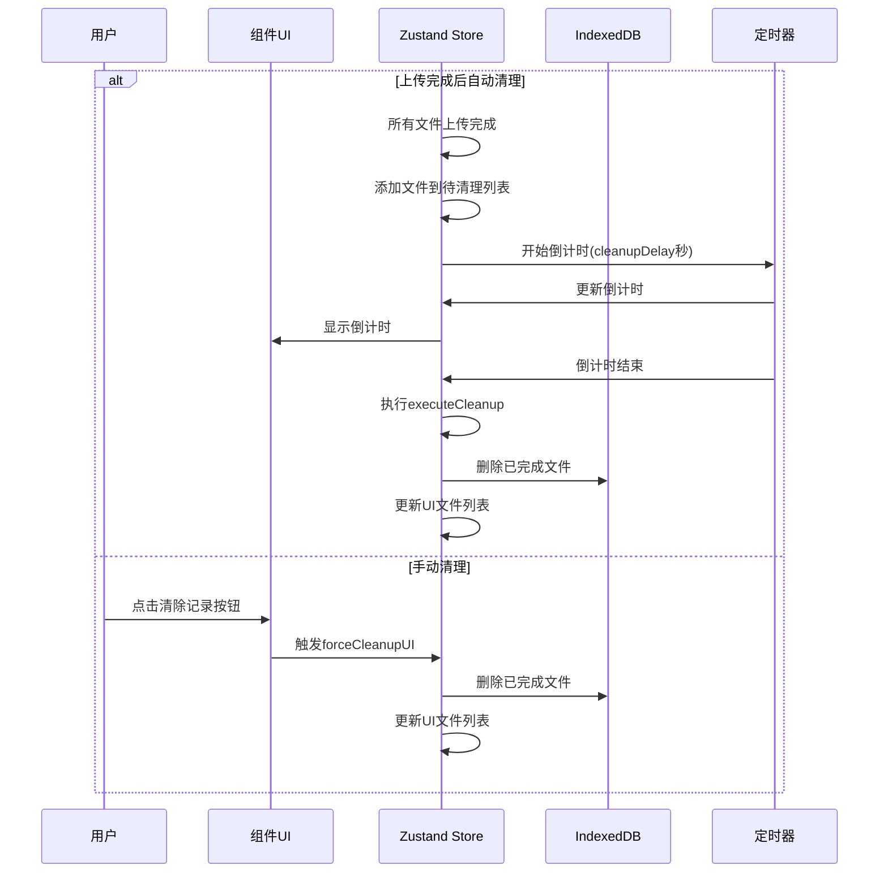
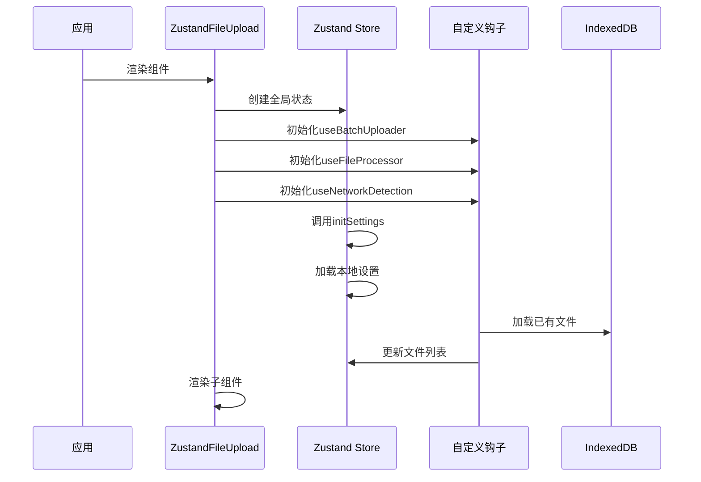
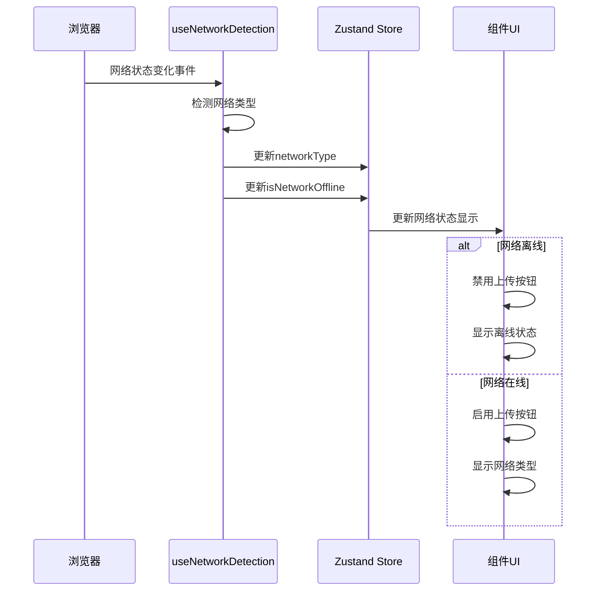
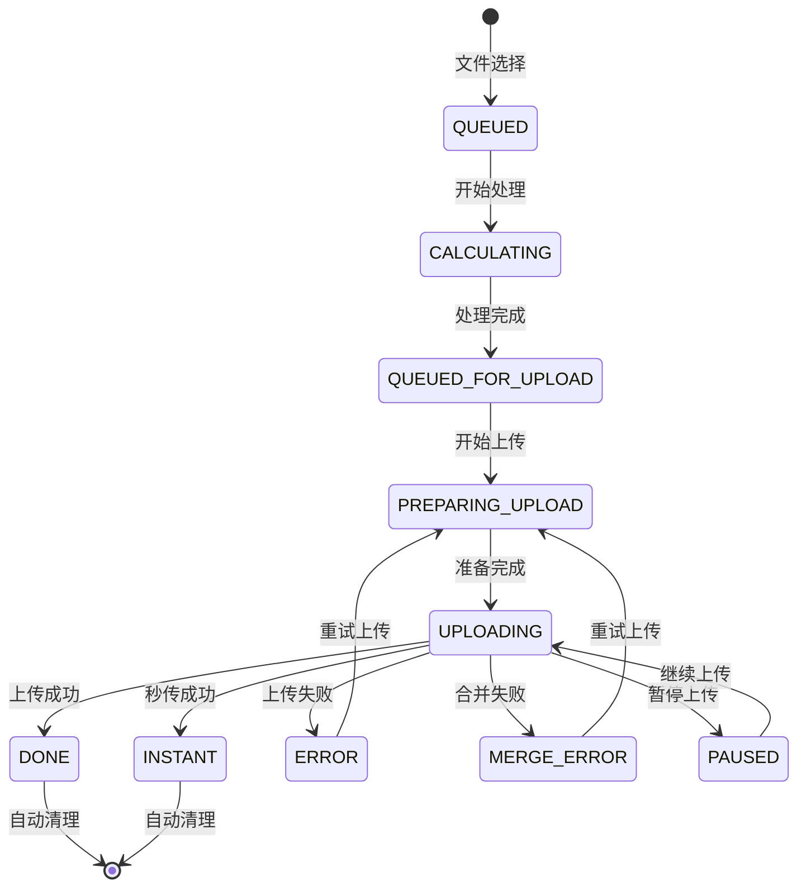
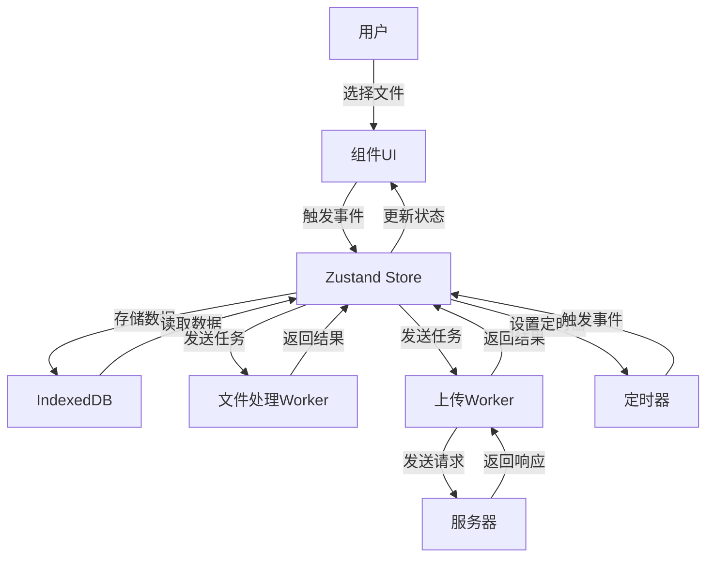

# ZustandFileUpload 组件时序图

## 文件上传流程

```mermaid
sequenceDiagram
    participant User as 用户
    participant UI as 组件UI
    participant Store as Zustand Store
    participant FPWorker as 文件处理Worker
    participant IndexedDB as IndexedDB
    participant UWorker as 上传Worker
    participant Server as 服务器

    User->>UI: 选择文件
    UI->>Store: 触发handleFileChange
    Store->>FPWorker: 发送文件数据
    FPWorker->>FPWorker: 计算文件哈希
    FPWorker->>FPWorker: 分片处理
    FPWorker->>Store: 返回处理结果
    Store->>IndexedDB: 存储文件数据
    Store->>UI: 更新文件列表

    alt 自动上传开启
        Store->>Store: 触发uploadAll
    else 手动上传
        User->>UI: 点击上传按钮
        UI->>Store: 触发uploadAll
    end

    Store->>IndexedDB: 获取待上传文件
    Store->>Store: 初始化批次信息
    loop 对每个文件
        Store->>IndexedDB: 更新文件状态为准备上传
        Store->>UWorker: 发送文件数据
        UWorker->>Server: 秒传确认请求

        alt 秒传成功
            Server->>UWorker: 返回秒传成功
            UWorker->>Store: 通知秒传完成
            Store->>IndexedDB: 更新文件状态为INSTANT
            Store->>Store: 更新批次信息
        else 需要上传
            UWorker->>UWorker: 准备分片上传
            loop 对每个分片
                UWorker->>Server: 上传分片
                Server->>UWorker: 返回上传结果
                UWorker->>Store: 更新上传进度
                Store->>UI: 显示进度条
            end
            Server->>UWorker: 返回合并结果
            UWorker->>Store: 通知上传完成
            Store->>IndexedDB: 更新文件状态为DONE
            Store->>Store: 更新批次信息
        end

        Store->>Store: 添加到已完成列表
    end

    Store->>UI: 显示完成状态
    Store->>Store: 开始清理倒计时
    Store->>UI: 显示倒计时
```

## 错误处理与重试流程

```mermaid
sequenceDiagram
    participant User as 用户
    participant UI as 组件UI
    participant Store as Zustand Store
    participant UWorker as 上传Worker
    participant IndexedDB as IndexedDB
    participant Server as 服务器

    alt 上传失败
        UWorker->>Server: 上传请求
        Server->>UWorker: 返回错误
        UWorker->>Store: 通知上传失败
        Store->>IndexedDB: 更新文件状态为ERROR
        Store->>UI: 显示错误状态
    end

    alt 单文件重试
        User->>UI: 点击单个文件重试按钮
        UI->>Store: 触发handleRetryUpload
        Store->>Store: 调用retryUploadFile
        Store->>IndexedDB: 更新文件状态为准备上传
        Store->>UWorker: 重新发送文件数据
        UWorker->>Server: 重新上传
    else 批量重试
        User->>UI: 点击批量重试按钮
        UI->>Store: 触发handleRetryAllUpload
        Store->>Store: 调用retryAllFailedFiles
        Store->>IndexedDB: 获取所有错误文件
        Store->>Store: 初始化批次信息
        loop 对每个错误文件
            Store->>Store: 调用retryUploadFile
            Store->>UWorker: 重新发送文件数据
            UWorker->>Server: 重新上传
        end
    end
```

## 自动清理流程

```mermaid
sequenceDiagram
    participant User as 用户
    participant UI as 组件UI
    participant Store as Zustand Store
    participant IndexedDB as IndexedDB
    participant Timer as 定时器

    alt 上传完成后自动清理
        Store->>Store: 所有文件上传完成
        Store->>Store: 添加文件到待清理列表
        Store->>Timer: 开始倒计时(cleanupDelay秒)
        Timer->>Store: 更新倒计时
        Store->>UI: 显示倒计时
        Timer->>Store: 倒计时结束
        Store->>Store: 执行executeCleanup
        Store->>IndexedDB: 删除已完成文件
        Store->>Store: 更新UI文件列表
    else 手动清理
        User->>UI: 点击清除记录按钮
        UI->>Store: 触发forceCleanupUI
        Store->>IndexedDB: 删除已完成文件
        Store->>Store: 更新UI文件列表
    end
```

## 组件初始化流程

```mermaid
sequenceDiagram
    participant App as 应用
    participant ZFU as ZustandFileUpload
    participant Store as Zustand Store
    participant Hooks as 自定义钩子
    participant IndexedDB as IndexedDB

    App->>ZFU: 渲染组件
    ZFU->>Store: 创建全局状态
    ZFU->>Hooks: 初始化useBatchUploader
    ZFU->>Hooks: 初始化useFileProcessor
    ZFU->>Hooks: 初始化useNetworkDetection
    Store->>Store: 调用initSettings
    Store->>Store: 加载本地设置
    Hooks->>IndexedDB: 加载已有文件
    Hooks->>Store: 更新文件列表
    ZFU->>ZFU: 渲染子组件
```

## 网络状态检测流程

```mermaid
sequenceDiagram
    participant Browser as 浏览器
    participant Hook as useNetworkDetection
    participant Store as Zustand Store
    participant UI as 组件UI

    Browser->>Hook: 网络状态变化事件
    Hook->>Hook: 检测网络类型
    Hook->>Store: 更新networkType
    Hook->>Store: 更新isNetworkOffline
    Store->>UI: 更新网络状态显示

    alt 网络离线
        UI->>UI: 禁用上传按钮
        UI->>UI: 显示离线状态
    else 网络在线
        UI->>UI: 启用上传按钮
        UI->>UI: 显示网络类型
    end
```

## 文件状态转换流程

```mermaid
stateDiagram-v2
    [*] --> QUEUED: 文件选择
    QUEUED --> CALCULATING: 开始处理
    CALCULATING --> QUEUED_FOR_UPLOAD: 处理完成
    QUEUED_FOR_UPLOAD --> PREPARING_UPLOAD: 开始上传
    PREPARING_UPLOAD --> UPLOADING: 准备完成

    UPLOADING --> DONE: 上传成功
    UPLOADING --> INSTANT: 秒传成功
    UPLOADING --> ERROR: 上传失败
    UPLOADING --> MERGE_ERROR: 合并失败

    ERROR --> PREPARING_UPLOAD: 重试上传
    MERGE_ERROR --> PREPARING_UPLOAD: 重试上传

    DONE --> [*]: 自动清理
    INSTANT --> [*]: 自动清理

    UPLOADING --> PAUSED: 暂停上传
    PAUSED --> UPLOADING: 继续上传
```

## 数据流向图

```mermaid
flowchart TD
    User[用户] -->|选择文件| UI[组件UI]
    UI -->|触发事件| Store[Zustand Store]
    Store -->|更新状态| UI

    Store -->|存储数据| IndexedDB[IndexedDB]
    IndexedDB -->|读取数据| Store

    Store -->|发送任务| FPWorker[文件处理Worker]
    FPWorker -->|返回结果| Store

    Store -->|发送任务| UWorker[上传Worker]
    UWorker -->|返回结果| Store

    UWorker -->|发送请求| Server[服务器]
    Server -->|返回响应| UWorker

    Store -->|设置定时器| Timer[定时器]
    Timer -->|触发事件| Store
```
